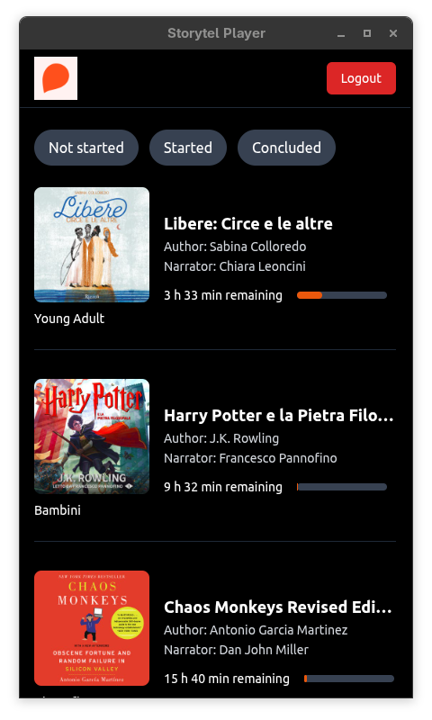
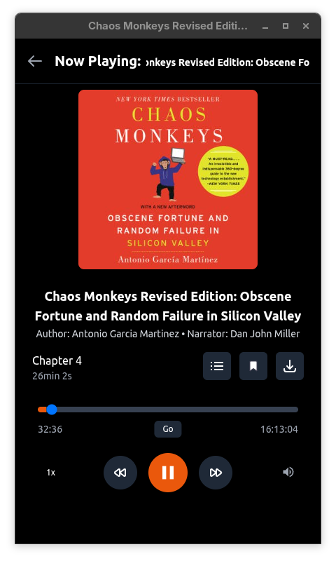

# Storytel Player for Desktop


[](https://snyk.io//test/github/debba/storytel-player?targetFile=package.json)

**Unoffical Storytel Player for Desktop** — a cross-platform desktop application for playing Storytel audiobooks, built with TypeScript, React, Fastify, and Electron.

## Download

<!-- DOWNLOAD_SECTION_START -->
<!-- DOWNLOAD_SECTION_END -->

✅ **Native Desktop App**: Cross-platform application with system tray integration and single instance lock

✅ **Audiobook Library**: Browse your Storytel library with cover art and progress tracking

✅ **Audio Player**: HTML5 audio player with playback controls and bookmarks

✅ **Session Management**: Secure authentication with persistent storage via electron-store

✅ **Internationalization**: Multi-language support (i18next) with automatic language detection

✅ **Cross-Platform**: Available for Windows, macOS (x64/ARM64), and Linux (x64/ARM64/ARMv7)

✅ **Development Mode**: Hot reload for both client and server during development

> [!NOTE]  
> This is an independent project, not affiliated with Storytel

## Screenshots

</img> </img>

## Features


## Architecture

The application is built with TypeScript and follows a modular architecture:

- **Frontend**: React 18 with TypeScript, Tailwind CSS, and Vite (port 3000 in dev mode)
- **Backend**: Fastify server with TypeScript and RESTful API (port 8080)
- **Desktop**: Electron 38+ with TypeScript
  - Window Manager: Main window handling with development/production modes
  - Tray Manager: System tray integration
  - Server Manager: Embedded Fastify server management
  - IPC Manager: Inter-process communication between Electron and React
- **Authentication**: Session-based authentication with secure storage
- **Audio Streaming**: Direct integration with Storytel's streaming API

## Prerequisites

- Node.js 22+ (see `.nvmrc` for the recommended version)
- npm 7+

## Installation

1. Clone the repository:
```bash
git clone <repository-url>
cd storytel-player
```

2. Install all dependencies:
```bash
npm run install-all
```

This command will install dependencies for the root project, server, and client.

## Development

Start the development environment with hot reload:

```bash
npm run dev
```

This will:
- Start the Fastify server on port 3001 (with tsx watch for auto-restart)
- Start the Vite development server on port 3000
- Both servers will reload automatically when files change

### Individual Components

You can also run components separately:

```bash
# Start only the server (development mode)
npm run server:dev

# Start only the client
npm run client

# Start both (without hot reload)
npm start
```

### Electron Development

To run the Electron app in development mode:

```bash
npm run electron:dev
```

## Building

### Build for Production

Build all components for production:

```bash
npm run build
```

This command builds the React client with Vite (`client/build/`).

### Build Electron App

Create distributable Electron packages:

```bash
# Build and create installer/distributable for current platform
npm run electron:dist

# Platform-specific builds
npm run electron:dist:win           # Windows (x64)
npm run electron:dist:mac:x64       # macOS (Intel)
npm run electron:dist:mac:arm64     # macOS (Apple Silicon)
npm run electron:dist:linux         # Linux (all targets)
npm run electron:dist:linux:x64     # Linux x64 (tar.gz, deb, rpm, AppImage)
npm run electron:dist:linux:arm64   # Linux ARM64
npm run electron:dist:linux:arm     # Linux ARMv7
```

The built applications will be available in the `dist/` directory.

**Build targets:**
- **Windows**: NSIS installer (.exe)
- **macOS**: DMG package (.dmg)
- **Linux**: AppImage, deb, rpm, Pacman packages

## Scripts

| Command | Description |
|---------|-------------|
| `npm start` | Start both client and server (production mode) |
| `npm run dev` | Start development servers with hot reload |
| `npm run build` | Build client with Vite |
| `npm run build-win` | Build client for Windows |
| `npm run server:build` | Build server with esbuild |
| `npm run install-all` | Install dependencies for all components |
| `npm run clean` | Clean all build directories |
| `npm run electron:build` | Compile Electron TypeScript files |
| `npm run electron` | Run Electron app (production) |
| `npm run electron:dev` | Run Electron app (development mode) |
| `npm run electron:pack` | Package Electron app without installer |
| `npm run electron:dist` | Build and create installer for current platform |
| `npm run electron:dist:win` | Build Windows installer (x64) |
| `npm run electron:dist:linux` | Build all Linux packages |
| `npm run electron:dist:linux:x64` | Build Linux x64 packages |
| `npm run electron:dist:linux:arm64` | Build Linux ARM64 packages |
| `npm run electron:dist:linux:arm` | Build Linux ARMv7 packages |
| `npm run electron:dist:mac:x64` | Build macOS Intel package |
| `npm run electron:dist:mac:arm64` | Build macOS Apple Silicon package |

## Configuration

### Environment Variables

Create a `.env` file in the `server/` directory:

```env
# Add your environment variables here
# See server/.env.example for reference
```

### Electron Builder

Electron Builder configuration is in `package.json` under the `build` key:

- **App ID**: `com.storytel.player`
- **Product Name**: `Storytel Player`
- **Output Directory**: `dist/`

## Development Notes

- The Electron app features a compact UI (480x800 window size) optimized for desktop use
- Single instance lock prevents multiple app instances from running simultaneously
- In development mode, the app connects to local dev servers (React on port 3000, Fastify on port 3001)
- In production mode, the app serves static files from `client/build/` and runs the bundled server
- The embedded Fastify server is managed by the Electron main process
- TypeScript is used throughout the project (Electron, React, and Fastify)
- Certificate errors are ignored in development mode for local HTTPS testing

## Technologies Used

- **Frontend**: React 18, TypeScript, Tailwind CSS, Vite, i18next, Axios
- **Backend**: Fastify 5, TypeScript, @fastify/cors, dotenv
- **Desktop**: Electron 38+, electron-store
- **Build Tools**: Vite, esbuild, electron-builder, TypeScript compiler
- **Development**: Concurrently, tsx (for server watch mode)

## License

MIT License

## Author

Andrea Debernardi (andrea@debbaweb.it)
